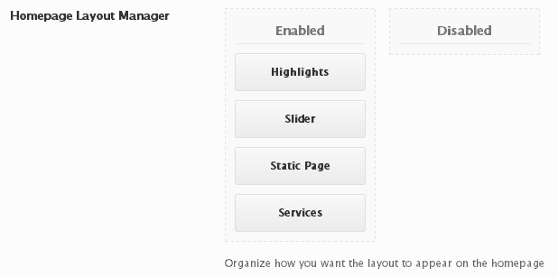

# Sorter

The Sorter field enabled the user to specify blocks that can be organized between the Enabled and Disabled columns via drag-and-drop.

<span style="display:block;text-align:center"></span>

::: warning Table of Contents
[[toc]]
:::

## Arguments
|Name|Type|<div style="width:70px;">Default</div>|Description|
|--- |--- |--- |--- |
|type|string|`sorter`|Value identifying the field type.|
|options|array||Array specifying the enabled or disables state for the individual blocks.  See 'Options Array' below.|

::: tip Also See
- [Global Field Arguments](../configuration/fields/arguments.md)
- [Using the `compiler` Argument](../configuration/fields/compiler.md)
- [Using the `data` Argument](../configuration/fields/data.md)
- [Using the `permissions` Argument](../configuration/fields/permissions.md)
- [Using the `required` Argument](../configuration/fields/required.md)
:::

### Options Array
|Name|Type|Description|
|--- |--- |--- |
|disabled|array|key pair value for the disabled column.|
|enabled|array|key pair value for the enabled column.|

The first parameter of the value pair must be a string type representing a unique ID for the element.  The second parameter must be a string type representing the display name of the element. See the code below for an example.

## Build Config
<script>
import builder from './sorter.json';
export default {
    data () {
        return {
            builder: builder,
            defaults: {}
        };
    }
}
</script>
<builder :builder_json="builder" :builder_defaults="defaults" />


## Example Config

```php
Redux::set_field( 'OPT_NAME', 'SECTION_ID', array(
    'id'      => 'homepage-blocks',
    'type'    => 'sorter',
    'title'   => 'Homepage Layout Manager',
    'desc'    => 'Organize how you want the layout to appear on the homepage',
    'options' => array(
        'enabled'  => array(
            'highlights' => 'Highlights',
            'slider'     => 'Slider',
            'staticpage' => 'Static Page',
            'services'   => 'Services'
        ),
        'disabled' => array(
        )
    ),
) );
```

## Example Usage
This example in based on the example usage provided above. Be sure to change `$redux_demo` to the value you specified in your [opt_name](../configuration/global_arguments.md#opt_name) argument.
```php
global $redux_demo;

echo 'Enabled column' . '<br />'; 
print_r ($redux_demo['homepage-blocks']['enabled']);

echo 'Disabled column' . '<br />'; 
print_r ($redux_demo['homepage-blocks']['disabled']);
```

This example is a real-use example in case you were looking to include a template.

```php
global $redux_options;
$layout = $redux_options['home_blocks']['enabled'];

if ( $layout ): foreach ( $layout as $key => $value ) {
    switch($key) {
        case 'slider': get_template_part( 'templates/content', 'slider' );
        break;

        case 'highlights': get_template_part( 'templates/content', 'highlights' );
        break;

        case 'services': get_template_part( 'templates/content', 'services' );
        break;
        
        case 'staticpage': get_template_part( 'templates/content', 'staticpage' );    
        break;  
    }
}

endif;
```

